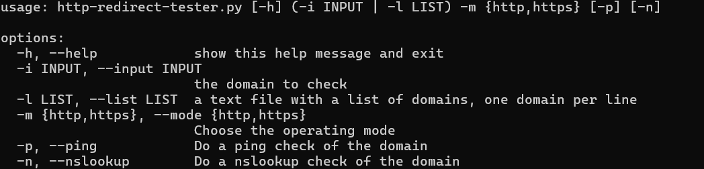
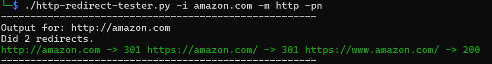

# http-redirect-tester
A python tool to follow http redirects and check the redirect chain.

## Requirements

- httpie
- nslookup
- ping
- Linux OS

At the moment this tool only runs on linux.
This tools uses httpie to do the requests and follow the redirect chain.
For dns checks nslookup is also required.

# Python
Tested with python 3.11

## Installation

Just clone the repo and run the python file.

## Usage

## Demo

## Authors
- [@pprugger](https://www.github.com/pprugger)